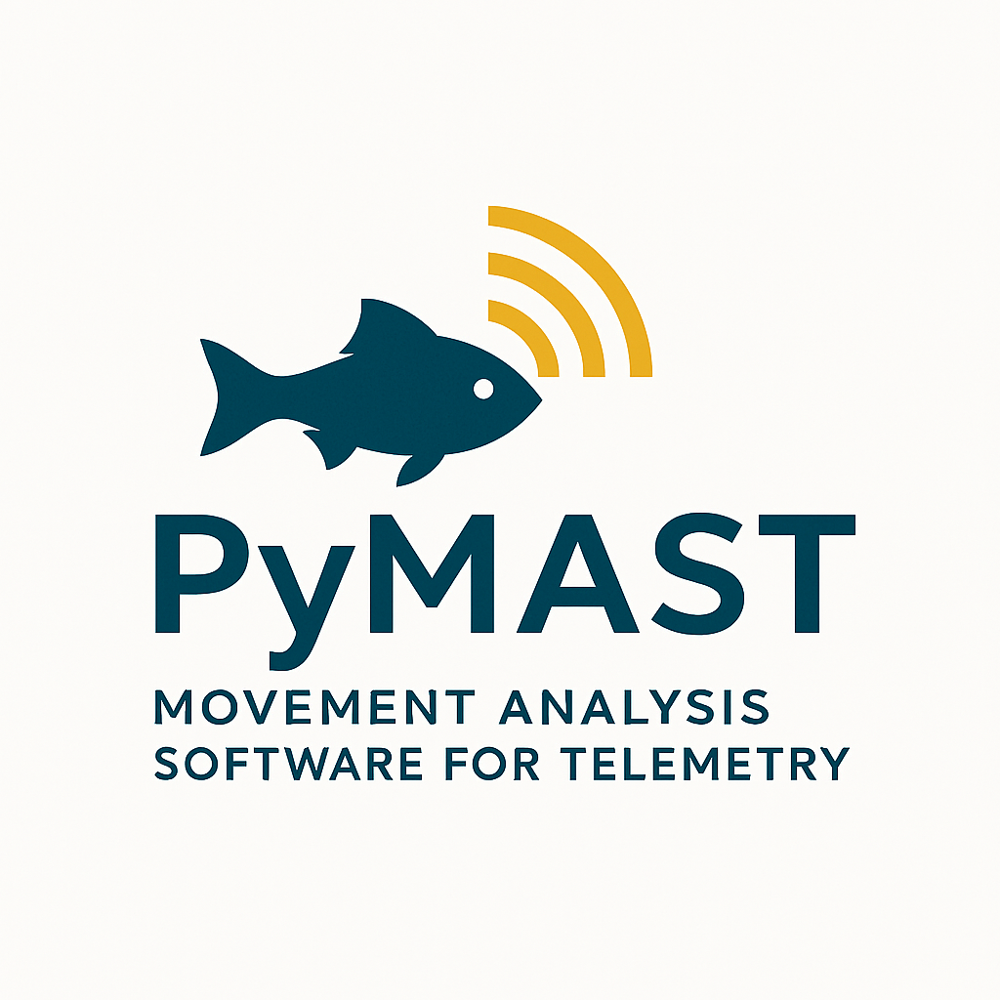

# PyMAST - Movement Analysis Software for Telemetry

<p align="center">
  
</p>

<p align="center">
  <a href="https://opensource.org/licenses/MIT"></a>
  <a href="https://www.python.org/downloads/"></a>
</p>

**PyMAST** (Movement Analysis Software for Telemetry) is a comprehensive Python toolkit for processing, analyzing, and modeling radio telemetry data. From data import to statistical model export, PyMAST provides a complete solution for aquatic telemetry studies.

## 🎯 Key Features

- **Multi-Manufacturer Support** - Import from Lotek (SRX600/800/1200), Orion, ARES, and VR2 receivers
- **Automated Classification** - Naive Bayes classifier removes false positives
- **Bout Detection** - DBSCAN clustering identifies continuous presence periods
- **Overlap Resolution** - Signal quality comparison resolves spatial ambiguity
- **Movement Filtering** - Adjacency filter removes impossible transitions
- **Statistical Export** - CJS, LRDR, and Time-to-Event formats for Program MARK/R
- **HDF5 Database** - Fast queries and efficient storage for large datasets
- **Comprehensive Documentation** - All modules accessible via Python `help()` system
- **Visualization Suite** - Network graphs, bout distributions, overlap analysis, 3D fish tracks

---

## 🚀 Quick Start

**👉 New users: Start with [GETTING_STARTED.md](GETTING_STARTED.md) for a complete walkthrough!**

**👉 New users: Start with [GETTING_STARTED.md](GETTING_STARTED.md) for a complete walkthrough!**

### Installation

```bash
pip install pymast
```

Or from source:

```bash
cd mast
pip install -e .
```

### 30-Second Example

```python
from pymast.radio_project import radio_project
import pandas as pd

# Initialize project
proj = radio_project(
    project_dir='C:/my_study',
    db_name='study.h5',
    tag_list=pd.read_csv('tags.csv'),
    rec_list=pd.read_csv('receivers.csv')
)

# Import receiver data
proj.import_data(
    file_name='receiver_001.csv',
    receiver_make='srx1200',
    rec_id='REC001',
    scan_time=2.5,
    channels=1
)

# Process and analyze
proj.make_recaptures_table()
```

See [GETTING_STARTED.md](GETTING_STARTED.md) for complete workflows.

---

## 📚 Documentation

| Document | Description |
|----------|-------------|
| **[GETTING_STARTED.md](GETTING_STARTED.md)** | 👈 **Start here!** Complete setup guide |
| [ARCHITECTURE.md](ARCHITECTURE.md) | System design, database structure, workflow |
| [docs/TUTORIAL.md](docs/TUTORIAL.md) | Step-by-step analysis examples |
| [docs/API_REFERENCE.md](docs/API_REFERENCE.md) | Detailed function documentation |
| [CHANGELOG.md](CHANGELOG.md) | Version history and updates |

### In-Code Documentation

All modules support Python's `help()` system:

```python
import pymast
help(pymast.parsers)              # Module overview
help(pymast.overlap_removal.bout) # Class documentation  
help(pymast.naive_bayes.calculate_likelihood)  # Function details
```

---

## 🏗️ System Architecture

```
Raw Receiver Files
       ↓
   [Parsers] → Import to HDF5
       ↓
   [Classification] → Remove false positives
       ↓
   [Recaptures] → Link detections to locations
       ↓
   [Bout Detection] → Identify presence periods
       ↓
   [Overlap Resolution] → Resolve spatial ambiguity
       ↓
   [Adjacency Filter] → Remove impossible movements
       ↓
   [Formatter] → Export CJS/LRDR/TTE
       ↓
Program MARK / R Analysis
```

See [ARCHITECTURE.md](ARCHITECTURE.md) for details.

---

## 📋 System Requirements

- **Python**: 3.8 or higher
- **RAM**: 8+ GB recommended for large datasets
- **Storage**: HDF5 database typically 20-50% of raw data size
- **Disk Space**: 10+ GB for large projects with beacon tags
- **Operating System**: Windows, macOS, or Linux

### Required Input Files

MAST requires three CSV files to initialize a project:

#### 1. Master Tag File (`tblMasterTag.csv`)

| Field      | Type     | Required | Description                                    |
|------------|----------|----------|------------------------------------------------|
| freq_code  | string   | Yes      | Unique frequency-code combination              |
| pulse_rate | float    | Yes      | Seconds between tag pulses                     |
| tag_type   | string   | Yes      | 'study', 'BEACON', or 'TEST'                   |
| rel_date   | datetime | Yes      | Release date and time (YYYY-MM-DD HH:MM:SS)    |
| rel_loc    | string   | Yes      | Release location                               |
| cap_loc    | string   | Yes      | Capture location                               |
| mort_rate  | float    | No       | Mortality pulse rate (if equipped)             |
| length     | int      | No       | Fish length (mm)                               |
| weight     | float    | No       | Fish weight (g)                                |
| species    | string   | No       | Species name                                   |
| sex        | string   | No       | 'M' or 'F'                                     |

**Example:**
```csv
freq_code,pulse_rate,tag_type,rel_date,rel_loc,cap_loc,length,species
164.123 45,3.0,study,2024-05-15 08:30:00,Release Site 1,Capture Site A,450,Atlantic Salmon
164.234 12,5.0,BEACON,2024-05-01 00:00:00,Beacon Location,Beacon Location,NA,NA
```

#### 2. Master Receiver File (`tblMasterReceiver.csv`)

| Field    | Type   | Required | Description                                   |
|----------|--------|----------|-----------------------------------------------|
| rec_id   | string | Yes      | Unique receiver identifier                    |
| rec_type | string | Yes      | 'srx600', 'srx800', 'srx1200', 'orion', 'ares', 'VR2' |
| node     | string | Yes      | Network node identifier                       |
| name     | string | No       | Common name for receiver location             |

**Example:**
```csv
rec_id,rec_type,node,name
R01,srx800,N01,Downstream Array
R02,srx800,N02,Fishway Entrance
R03,orion,N03,Upstream Release
```

#### 3. Nodes File (`tblNodes.csv`)

| Field | Type   | Required | Description                          |
|-------|--------|----------|--------------------------------------|
| node  | string | Yes      | Unique node identifier (matches receivers) |
| reach | string | No       | Common name for river reach          |
| X     | int    | Yes      | Arbitrary X coordinate for visualization |
| Y     | int    | Yes      | Arbitrary Y coordinate for visualization |

**Note:** Use arbitrary coordinates for visualization, not actual lat/lon. This creates clearer network diagrams for sinuous river systems.

**Example:**
```csv
node,reach,X,Y
N01,Lower River,100,100
N02,Fishway,200,150
N03,Upper River,300,200
```

### Project Directory Structure

When you create a project, MAST automatically creates this structure:

```
your_project/
├── Data/
│   ├── tblMasterTag.csv
│   ├── tblMasterReceiver.csv
│   ├── tblNodes.csv
│   └── Training_Files/
│       └── [raw receiver files]
├── Output/
│   ├── Figures/
│   └── recaptures.csv
└── your_database.h5
```

---

## 🔬 Workflow Steps

### 1. Project Initialization

```python
from pymast.radio_project import radio_project
import pandas as pd
import os

project_dir = r"C:\MyProject"
db_name = 'my_study'

# Load input files
tags = pd.read_csv(os.path.join(project_dir, 'tblMasterTag.csv'))
receivers = pd.read_csv(os.path.join(project_dir, 'tblMasterReceiver.csv'))
nodes = pd.read_csv(os.path.join(project_dir, 'tblNodes.csv'))

# Create project (detection_count and duration are classifier parameters)
project = radio_project(
    project_dir=project_dir,
    db_name=db_name,
    detection_count=5,      # Number of detections in detection history window
    duration=1,             # Duration (minutes) for noise ratio calculation
    tag_data=tags,
    receiver_data=receivers,
    nodes_data=nodes
)
```

### 2. Import Raw Data

```python
# Import data from one receiver
project.telem_data_import(
    rec_id='R01',                    # Receiver ID from tblMasterReceiver
    rec_type='srx800',               # Receiver type
    file_dir=os.path.join(project_dir, 'Data', 'Training_Files'),
    db_dir=os.path.join(project_dir, f'{db_name}.h5'),
    scan_time=1,                     # Channel scan time (seconds) for Orion/Ares
    channels=1,                      # Number of channels for Orion/Ares
    ant_to_rec_dict={'A0': 'R01'}    # Antenna to receiver mapping
)

# Undo import if needed
# project.undo_import('R01')
```

### 3. Train Classifier

Training creates a dataset of known true and false positive detections using beacon tags and miscoded detections.

```python
rec_id = 'R01'
rec_type = 'srx800'

# Get all fish detected at this receiver
fishes = project.get_fish(rec_id=rec_id)

# Train on each fish
for fish in fishes:
    project.train(fish, rec_id)

# Generate training summary with visualization
project.training_summary(rec_type, site=[rec_id])

# Undo training if needed
# project.undo_training(rec_id)
```

### 4. Classify Detections

Apply the Naive Bayes classifier to identify false positives.

```python
project.reclassify(
    project=project,
    rec_id='R01',
    rec_type='srx800',
    threshold_ratio=1.0,  # 1.0 = MAP hypothesis, >1.0 = more strict, <1.0 = less strict
    likelihood_model=['hit_ratio', 'cons_length', 'noise_ratio', 'power', 'lag_diff']
)

# Undo classification if needed
# project.undo_classification('R01')
```

**Available Likelihood Predictors:**
- `hit_ratio`: Proportion of expected pulses detected
- `cons_length`: Maximum consecutive detections
- `noise_ratio`: Ratio of miscoded to correct detections
- `power`: Signal strength
- `lag_diff`: Second-order difference in detection intervals

### 5. Bout Detection (Optional)

Identify discrete presence events at receivers.

```python
import pymast

node = 'N01'
bout = pymast.bout(project, node, lag_window=2, time_limit=21600)

# Fit processes to find optimal threshold
threshold = bout.fit_processes()

# Calculate presences using fitted threshold
bout.presence(threshold)

# Or use a manual threshold (seconds)
# bout.presence(120)

# Undo if needed
# project.undo_bouts(node)
```

### 6. Overlap Removal (Optional)

Remove detections from parent receivers when fish is present at nested child receivers.

```python
import pymast

# Define parent:child relationships (large:small detection zones)
edges = [
    ('R01', 'R02'),  # R01 overlaps R02
    ('R01', 'R03'),  # R01 overlaps R03
    ('R02', 'R04'),  # R02 overlaps R04
]

nodes = ['R01', 'R02', 'R03', 'R04']

# Create overlap object and apply nested doll algorithm
doll = pymast.overlap_reduction(nodes, edges, project)
doll.nested_doll()

# Alternative: unsupervised removal (uses clustering)
# doll.unsupervised_removal()

# Undo if needed
# project.undo_overlap()
```

### 7. Create Recaptures Table

Compile all classified, de-overlapped detections into a final recaptures table.

```python
# Create and export recaptures table
project.make_recaptures_table(export=True)

# Output will be saved to: Output/recaptures.csv

# Undo if needed
# project.undo_recaptures()
```

---

## 📊 Statistical Data Formatting

### Cormack-Jolly-Seber (CJS) Format

```python
from pymast.formatter import cjs_data_prep

# Define receiver to recapture occasion mapping
receiver_to_recap = {
    'R01': 'R00',  # Release
    'R02': 'R01',  # First recapture
    'R03': 'R02',  # Second recapture
    'R04': 'R03',  # Third recapture
}

# Create CJS formatted data
cjs = cjs_data_prep(
    receiver_to_recap=receiver_to_recap,
    project=project,
    rel_loc='Release Site 1',  # Optional filter
    initial_recap_release=False  # True if starting from first recapture
)

# Export to .inp file for Program MARK
cjs.input_file('my_model', project.output_dir)
```

### Competing Risks / Time-to-Event Format

```python
from pymast.formatter import time_to_event

# Define node to state mapping
node_to_state = {
    'N01': 1,  # Downstream
    'N02': 2,  # Fishway
    'N03': 3,  # Upstream
}

# Create time-to-event data
tte = time_to_event(
    node_to_state=node_to_state,
    project=project,
    bucket_length_min=15  # Time bin size in minutes
)

# Export for survival analysis in R
tte.to_csv(os.path.join(project.output_dir, 'time_to_event.csv'))
```

---

## 🎨 Visualization

### Fish Movement History

```python
from pymast.fish_history import fish_history

# Create fish history object
fh = fish_history(
    projectDB=project.db,
    filtered=True,        # Use classified data
    overlapping=False     # Exclude overlapping detections
)

# Plot a specific fish in 3D space-time
fh.fish_plot('164.123 45')
```

---

## 🛠️ Supported Receiver Types

| Manufacturer | Model           | Code       | Notes                           |
|--------------|-----------------|------------|---------------------------------|
| Lotek        | SRX600          | `srx600`   | Standard format                 |
| Lotek        | SRX800          | `srx800`   | Standard format                 |
| Lotek        | SRX1200         | `srx1200`  | Standard format                 |
| SigmaEight   | Orion           | `orion`    | Supports multi-channel/antenna  |
| SigmaEight   | Ares            | `ares`     | Multiple firmware versions      |
| Vemco        | VR2             | `VR2`      | Standard format                 |

---

## 🔬 Scientific Background

PyMAST implements validated algorithms for radio telemetry data processing, peer-reviewed and published in *Animal Biotelemetry*:

> **Nebiolo, K.P., & Castro-Santos, T.** (2024). MAST: Movement Analysis Software for Telemetry data. Part I: the semi-automated removal of false positives from radio telemetry data. *Animal Biotelemetry*, 12(1), 11. https://doi.org/10.1186/s40317-024-00358-1

### False Positive Detection Algorithm

MAST uses a **Naive Bayes classifier** with the conditional independence assumption:

```
P(True|X) ∝ P(True) × ∏ P(Xi|True)
P(False|X) ∝ P(False) × ∏ P(Xi|False)
```

Where X represents the vector of predictor variables. The classifier computes the posterior probability for each detection and classifies using the Maximum A Posteriori (MAP) hypothesis.

**Key Innovation:** Laplace smoothing (add-one smoothing) prevents zero probabilities for unseen feature combinations, making the classifier robust to novel detection patterns.

### Bout Detection Algorithm

Fits a **three-process broken-stick model** (piecewise exponential decay) to inter-detection intervals:

1. **Process 1**: Continuous presence (seconds to minutes)
2. **Process 2**: Edge milling behavior (minutes to hours)
3. **Process 3**: True departure and return (hours to days)

The knot locations determine threshold values for classifying detection gaps.

### Nested Doll Overlap Removal

Uses a **directed acyclic graph** (DAG) representing parent:child relationships between receivers. If a fish is present at a child receiver (small detection zone) while also detected at a parent receiver (large detection zone), the algorithm removes the overlapping parent detections.

**Analogy:** Like nested Russian dolls - if you can place an object in the innermost doll, you know it's not in the outer dolls.

---

## 📖 Examples

See the following for complete examples:

- **`MAST_Project.ipynb`** - Interactive Jupyter notebook with full workflow
- **`scripts/mast_complete_project.py`** - Python script implementation
- **Sample data** - Check `data/` folder for example file formats

---

## 🤝 Contributing

We welcome contributions! Please see [CONTRIBUTING.md](CONTRIBUTING.md) for guidelines.

**Quick Development Setup:**

```bash
git clone https://github.com/knebiolo/mast.git
cd mast
python -m venv venv
venv\Scripts\activate  # Windows
# source venv/bin/activate  # macOS/Linux
pip install -e .
```

---

## 📄 Citation

If you use PyMAST in your research, please cite:

```bibtex
@article{nebiolo2024mast,
  author = {Nebiolo, Kevin P. and Castro-Santos, Theodore},
  title = {MAST: Movement Analysis Software for Telemetry data. Part I: the semi-automated removal of false positives from radio telemetry data},
  journal = {Animal Biotelemetry},
  year = {2024},
  volume = {12},
  number = {1},
  pages = {11},
  doi = {10.1186/s40317-024-00358-1},
  url = {https://doi.org/10.1186/s40317-024-00358-1}
}
```

**Software Citation:**

```bibtex
@software{nebiolo2025pymast,
  author = {Nebiolo, Kevin P. and Castro-Santos, Theodore},
  title = {PyMAST: Movement Analysis Software for Telemetry},
  year = {2025},
  publisher = {GitHub},
  url = {https://github.com/knebiolo/mast}
}
```

**Additional Key Publications:**

- Beeman, J.W., & Perry, R.W. (2012). *Bias from False-Positive Detections and Strategies for their Removal in Studies Using Telemetry.* American Fisheries Society.
- Sibly, R.M., Nott, H.M., & Fletcher, D.J. (1990). *Splitting Behavior into Bouts.* Animal Behavior.

---

## 📝 License

This project is licensed under the MIT License - see [LICENSE.txt](LICENSE.txt) for details.

---

## 👥 Authors & Acknowledgments

**Development Team:**
- **Kevin P. Nebiolo** - Lead Developer (Kleinschmidt Associates)
- **Theodore Castro-Santos** - Co-Developer (USGS)

**Institutional Support:**
- Kleinschmidt Associates
- U.S. Geological Survey (USGS)

**Community:**
- Thanks to the aquatic telemetry community for feedback and testing

---

## 🐛 Support

- **Issues**: [GitHub Issues](https://github.com/knebiolo/mast/issues)
- **Email**: kevin.nebiolo@kleinschmidtgroup.com
- **Documentation**: See [CHANGELOG.md](CHANGELOG.md) for version history

---

## 📚 Additional Resources

- [HDF5 Documentation](https://www.hdfgroup.org/)
- [Program MARK](http://www.phidot.org/software/mark/)
- [R survival package](https://cran.r-project.org/web/packages/survival/)

---

**Happy Fish Tracking! 🐟📡**
